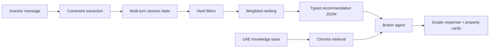

# UAE Off-Plan Property Advisor

A hybrid AI recommendation system for UAE off-plan property research. It turns a conversational investor request into structured constraints, applies deterministic filtering and ranking to a property catalog, and gives an LLM agent grounded data for its explanation.

The central design choice is to separate **facts and ranking** from **language generation**: prices, locations, handover dates, and scores come from typed application logic; the model explains the resulting shortlist and retrieves supporting knowledge-base passages.

## System flow



## Engineering highlights

- **Structured multi-turn state.** Budget, bedrooms, area, location, property type, handover window, status, must-haves, and preferences persist across a conversation and can be updated or cleared explicitly.
- **Deterministic constraint handling.** A local parser handles common requests without an LLM; typed model extraction can be enabled as an optional fallback.
- **Hard filters before soft ranking.** Mandatory constraints narrow the catalog first. Remaining properties are scored with an inspectable weighting: budget 40%, bedrooms 20%, location 20%, area 10%, and handover 10%.
- **Grounded agent output.** The broker agent receives the recommendation engine's typed JSON as source-of-truth context and is instructed not to invent listing fields.
- **Retrieval for domain questions.** Visa and regulatory questions use a Chroma vector store built from the local Markdown knowledge base.
- **Explicit failure behavior.** No-match responses return the applied filters and concrete suggestions for which constraint to relax.
- **Traceability.** Agent runs record metadata including turn number, filter count, candidates before/after filtering, returned-card count, and no-match state.

## Tests

The pytest suite covers:

- constraint parsing, merging, clearing, and range correction;
- catalog seeding and deterministic ranking;
- hard-filter and no-match behavior;
- missing-image and malformed-input fallbacks;
- Gradio recommendation-card rendering.

```bash
uv run pytest
```

## Run the demo

Requires Python 3.12+ and an OpenAI API key.

```bash
uv sync
# Set OPENAI_API_KEY in your environment or a local .env file
uv run gradio_demo.py
```

Set `ENABLE_LLM_CONSTRAINT_EXTRACTION=1` to enable the optional typed LLM extractor. By default, the deterministic parser is used. Set `GRADIO_SHARE=1` only when you intentionally want Gradio to create a public share link.

## Repository map

- `property_reco/types.py` — Pydantic domain models and session state.
- `property_reco/constraints.py` — deterministic and optional LLM constraint extraction.
- `property_reco/catalog.py` — Chroma-backed listing storage and hard filtering.
- `property_reco/scoring.py` — weighted ranking and recommendation results.
- `property_reco/seed.py` — reproducible synthetic listing generation.
- `asd.py` — broker agent, retrieval tools, tracing, and streaming.
- `gradio_demo.py` — interactive chat and recommendation-card interface.
- `tests/` — automated behavior and failure-mode coverage.

## Scope and responsible-use notes

The committed property catalog is synthetic demonstration data, and the knowledge-base material is not guaranteed to reflect current UAE law or policy. This application is a portfolio prototype for research and decision support—not financial, legal, immigration, or property advice. Users must verify listings and regulatory information with authoritative sources and qualified professionals.

